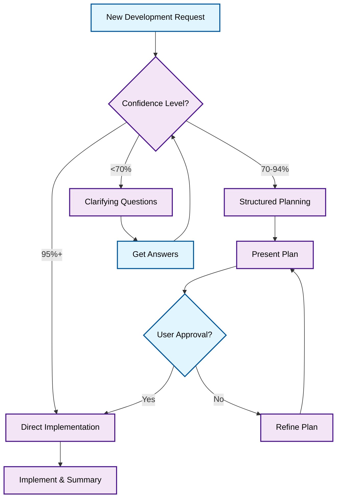

[](https://cursor.com)


# Confidence-Based Development Workflow for Cursor

## 🎯 Core Concept

A Cursor rule requiring 95% understanding before implementation. Optimized for existing projects.

## 🚀 Key Features

### 📊 Confidence-Based Decision Making
- **95%+ Confidence**: Direct implementation
- **70-94% Confidence**: Structured planning phase
- **<70% Confidence**: Systematic clarifying questions

### 🤔 Embrace Ambiguous Requests
- Start with unclear requirements - the AI will guide you to clarity
- Progressive questioning transforms vague ideas into concrete plans
- No need to overthink initial requests

### 📋 Structured Planning Templates
- Comprehensive implementation plans
- File structure visualization
- Impact assessment
- Risk analysis

### Workflow Decision Tree



**Legend:**
- 🔵 **Blue nodes**: User Input
- 🟣 **Purple nodes**: AI Process

## Example Workflows

### 🟢 High Confidence (95%+) - Direct Implementation
```
User: "Add a dark mode toggle button to the navbar component"

AI: "I understand the requirements with 95%+ confidence. I will proceed with implementation immediately.

The task is clear: adding a dark mode toggle to the existing navbar. I'll implement the toggle button with state management and theme switching functionality."

[Implements changes directly]

Summary of changes:
✅ Added dark mode toggle button to Navbar.jsx
✅ Implemented theme context with localStorage persistence
✅ Added CSS variables for light/dark theme colors
✅ Updated button styling with proper accessibility attributes
```

### 🟡 Medium Confidence (70-94%) - Structured Planning
`````
User: "Add user authentication with JWT tokens to our React app"

AI: "I understand the requirements with approximately 85% confidence. I will present a step-by-step implementation plan.

## 📋 Implementation Plan

### Overview
Implement JWT-based authentication system with login/logout functionality, protected routes, and token refresh mechanism.

### 📁 File Structure
```
src/
├── components/
│   ├── auth/
│   │   ├── LoginForm.jsx          # Login form component
│   │   ├── ProtectedRoute.jsx     # Route protection wrapper
│   │   └── AuthProvider.jsx       # Authentication context provider
├── hooks/
│   └── useAuth.js                 # Authentication hook
├── services/
│   └── authService.js             # API calls for authentication
└── utils/
    └── tokenManager.js            # JWT token management utilities
```

### Files to be Modified/Created:

1. **AuthService** (`src/services/authService.js`)
   - **Changes**: Create login, logout, refresh token API calls
   - **Reason**: Centralized authentication API management

2. **AuthContext** (`src/components/auth/AuthProvider.jsx`)
   - **Changes**: Context for user state and authentication methods
   - **Reason**: Global authentication state management

3. **Protected Routes** (`src/components/auth/ProtectedRoute.jsx`)
   - **Changes**: Component to wrap protected pages
   - **Reason**: Automatic redirect for unauthenticated users

### Assumptions and Considerations:
- Backend API endpoints: `/api/auth/login`, `/api/auth/refresh`
- JWT tokens stored in httpOnly cookies (recommended) or localStorage
- React Router v6 for navigation
- Automatic token refresh before expiration

### Impact Assessment:
- **Impact Level**: Medium
- **Scope**: Authentication flow, route protection, API integration

Type "go" to proceed with implementation, or let me know if you have questions/modifications."
`````

### 🔴 Low Confidence (<70%) - Clarifying Questions
```
User: "Optimize the application performance"

AI: "I need more specific information to provide an effective solution. Let me ask some clarifying questions:

## 🔍 Clarifying Questions

### 1. Performance Issue Identification
1.1) Slow page loading times (initial load)
1.2) Laggy user interactions (clicks, scrolling)
1.3) Memory leaks or high CPU usage
1.4) Slow API response times
1.5) Large bundle size affecting load time

### 2. Current Performance Metrics
2.1) Do you have specific metrics (Lighthouse scores, load times)?
2.2) Which pages/components are performing poorly?
2.3) Are there specific user flows that are slow?
2.4) What's the target performance improvement (e.g., 50% faster load time)?

### 3. Technical Stack Context
3.1) React with Create React App
3.2) Next.js application
3.3) Vite-based setup
3.4) Other framework/setup

### 4. Priority Areas
4.1) Frontend optimization (code splitting, lazy loading)
4.2) Backend optimization (database queries, caching)
4.3) Network optimization (CDN, compression)
4.4) Asset optimization (images, fonts, bundles)

## 💡 Common Performance Optimization Patterns

**A. Frontend Bundle Optimization**
- Code splitting with React.lazy()
- Tree shaking unused dependencies
- Image optimization and lazy loading
- Critical CSS extraction

**B. Runtime Performance**
- React.memo for expensive components
- useCallback/useMemo for expensive calculations
- Virtual scrolling for large lists
- Debouncing user inputs

**C. Network Performance**
- API response caching
- Request batching and deduplication
- Service worker for offline caching
- Preloading critical resources

Please provide more details about your specific performance concerns so I can create a targeted optimization plan."
```

## 🙏 Acknowledgments

This workflow was inspired by the concepts discussed in [this YouTube video](https://www.youtube.com/watch?v=LvsgCdWss4I).
