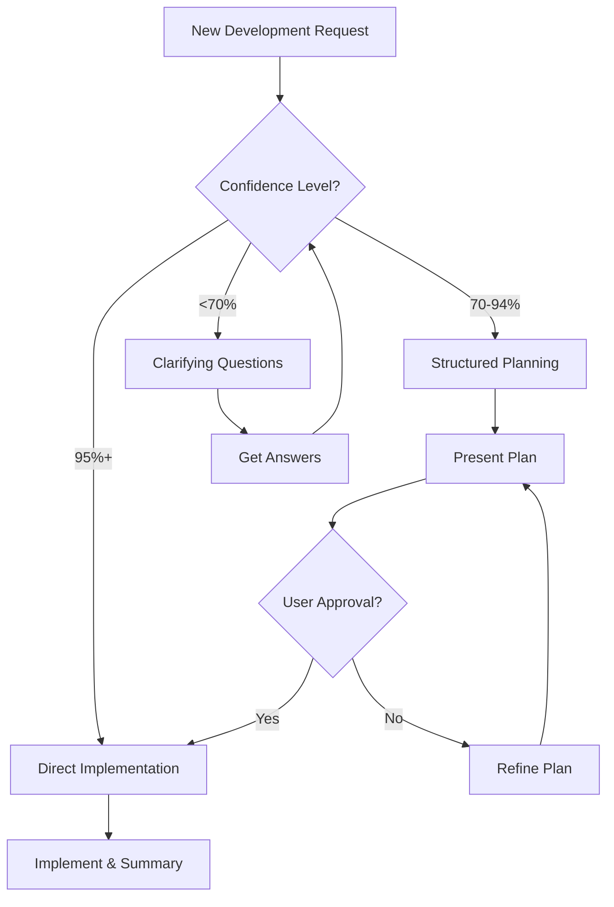

# Confidence-Based Development Workflow for Cursor

[](https://opensource.org/licenses/Apache-2.0)
[](https://cursor.sh)

> A structured Cursor rule for confident, focused development workflow

## 🎯 Overview

The Confidence-Based Development Workflow is a Cursor rule designed to optimize development productivity by ensuring you only implement changes when you have sufficient understanding. It addresses the common problem of jumping into implementation too quickly, which often leads to inefficient iterations and incomplete solutions.

## 💡 The Problem This Solves

**Traditional Development Issues:**
- Starting implementation without clear requirements
- Making changes without understanding the full scope
- Endless back-and-forth iterations due to unclear specifications
- Time wasted on wrong assumptions
- Inconsistent planning and documentation

**Our Solution:**
A confidence-based approach that ensures 95% understanding before implementation, with structured fallback workflows for different confidence levels.

## 🚀 Key Features

### 📊 Confidence-Based Decision Making
- **95%+ Confidence**: Direct implementation
- **70-94% Confidence**: Structured planning phase
- **<70% Confidence**: Systematic clarification questions

### 📋 Structured Planning Templates
- Comprehensive implementation plans
- File structure visualization
- Impact assessment
- Risk analysis

### Workflow Decision Tree



### Example Workflows

#### 🟢 High Confidence (95%+)
```
User: "Add a login button to the navbar"
AI: "I understand the requirements with 95%+ confidence. I will proceed with implementation immediately."
[Proceeds directly to implementation]
```

#### 🟡 Medium Confidence (70-94%)
```
User: "Implement user authentication"
AI: "I understand the requirements with approximately 85% confidence. I will present a step-by-step implementation plan."

📋 Implementation Plan
[Detailed planning with file structure, changes, and assumptions]

Type "go" to proceed with implementation.
```

#### 🔴 Low Confidence (<70%)
```
User: "Make the app faster"
AI: "🔍 Clarifying Questions

1. Performance Optimization Scope
   1.1) Frontend rendering performance
   1.2) Backend API response times
   1.3) Database query optimization
   1.4) Overall user experience improvements

2. Current Performance Issues
   [Structured questions to understand the specific problems]
```
